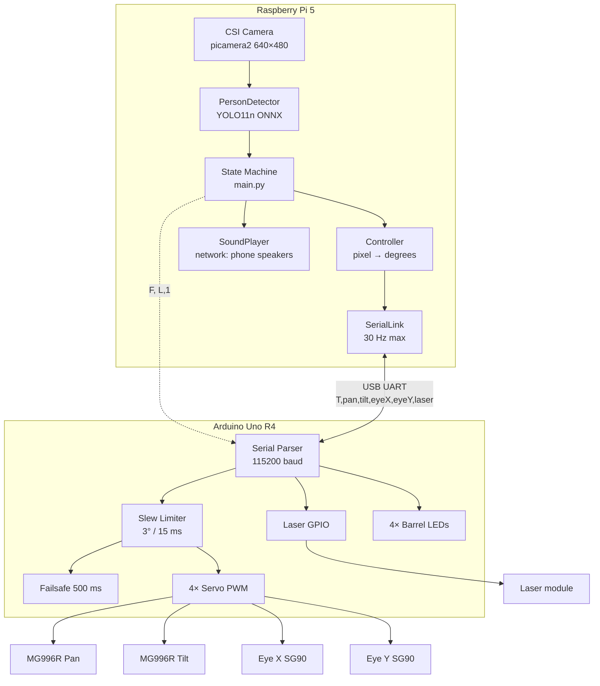

# System Architecture — Rapor taslağı (Section III)

---

## Yüksek seviye blok diyagramı (LaTeX / draw.io için)



---

## Veri akışı (frame döngüsü)

| Adım | Konum | Girdi | Çıktı |
|------|-------|-------|-------|
| 1 | `Camera.read()` | CSI frame | BGR `numpy` 640×480 |
| 2 | `PersonDetector.detect()` | BGR | `Target(cx,cy,w,h,conf)` veya `None` |
| 3 | FSM | target + timers | state ∈ {SEARCHING, ACQUIRED, TRACKING, LOST} |
| 4 | Aim point | `Target` + offsets | `(aim_x, aim_y)` piksel |
| 5 | `Controller.update()` | aim px veya idle angle | `ServoCommand` derece |
| 6 | `SerialLink.send()` | 5 int + laser bit | ASCII satır |
| 7 | Arduino `loop()` | parsed targets | `Servo.write()`, `digitalWrite` laser |

**Kritik tasarım kararı:** Tüm “zekâ” Pi’de; Arduino sadece **hedef açıları** uygular ve **fiziksel limit + failsafe** tutar.

---

## Donanım bağlantı tablosu (Tablo I için)

| Sinyal | Pi | Arduino pin | Not |
|--------|-----|-------------|-----|
| USB Serial | `/dev/ttyACM0` | USB | 115200 8N1 |
| Pan servo | — | 9 | MG996R |
| Tilt servo | — | 10 | MG996R |
| Eye X | — | 5 | SG90 class |
| Eye Y | — | 6 | SG90 class |
| Laser | — | 7 | Digital on/off |
| LED LL/LU/RL/RU | — | 2,3,12,13 | 470Ω each |
| Camera | CSI | — | Sabit montaj |
| Audio | **WiFi HTTP → telefon tarayıcı** | — | `audio_stream.py`; hoparlör driver arızası sonrası (`methodology-audio.md`) |

---

## Yazılım katmanları

```
┌─────────────────────────────────────┐
│  Application: main.Turret.run()     │
├─────────────────────────────────────┤
│  Perception: vision.Camera/Detector │
│  Planning:   FSM + fire bbox rule   │
│  Control:    controller.Controller  │
│  I/O:        serial_link, sound     │
├─────────────────────────────────────┤
│  Config:     config.yaml            │
└─────────────────────────────────────┘
          │ USB serial
┌─────────────────────────────────────┐
│  Firmware: readSerial, slew, failsafe│
│  Actuation: Servo library, GPIO      │
└─────────────────────────────────────┘
```

---

## Zamanlama ve frekanslar

| Parametre | Değer | Kaynak |
|-----------|-------|--------|
| Kamera hedef FPS | 30 | `config.yaml` camera.fps |
| Komut gönderimi | 30 Hz max | `serial.command_hz` |
| Arduino servo loop | ~66 Hz (15 ms) | `LOOP_MS` in .ino |
| Arduino slew | 3° / loop | `MAX_STEP_DEG` |
| Pi smoothing | 12°/frame max, α=0.55 | `smoothing` in yaml |
| Failsafe timeout | 500 ms | `FAILSAFE_MS` |

**Not:** Pi smoothing (12°/frame @ ~15–30 FPS) ve Arduino slew (3°/15 ms) **iki katmanlı rate limiting** — raporda “cascaded slew limits” olarak anlat.

---

## Güvenlik mimarisi

1. **Firmware clamps** when `limitsOn` (`L,1` at startup from `main.py`)
2. **Failsafe** → center pose + laser off
3. **Pi shutdown** → explicit center + laser 0
4. **RAW mode** only in `serial_test.py` (`L,0`) for mechanical limit finding

---

## Şekil önerileri (rapor)

1. **Fig. 1:** Yukarıdaki mermaid → TikZ blok diyagramı
2. **Fig. 2:** Fotoğraf veya CAD montaj (varsa ekle; yoksa kablolama şeması README’den)
3. **Fig. 3:** Sequence diagram: frame → detect → FSM → serial → servo (opsiyonel)

---

## LaTeX paragraf taslağı (İngilizce)

*The system follows a hierarchical architecture in which the Raspberry Pi 5 hosts all perception and decision-making—including ONNX-based YOLO11n edge inference without an on-device analytics stack—while the Arduino Uno R4 executes actuator commands with local slew-rate limiting and communication failsafe. Audio feedback is offloaded to smartphones over HTTP when local speaker hardware failed. This separation ensures that variable inference latency on the Pi does not compromise servo update regularity: the microcontroller services PWM at approximately 66 Hz regardless of frame processing time. A USB serial link carries comma-separated target angles at up to 30 Hz; additional single-character commands trigger LED fire choreography without blocking the main tracking stream. Mechanical structure was 3D-designed and printed by part of the team; wiring and power distribution were integrated by a dedicated electrical lead (see team-and-contributions.md).*
