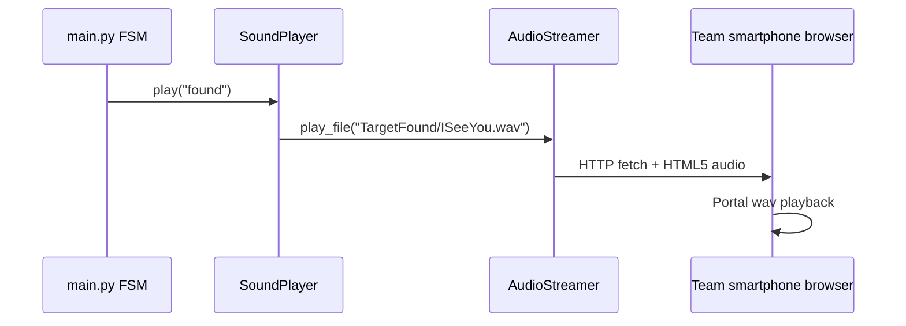

# Methodology — Audio / Telefon Hoparlör (Rapor alt bölümü)

> Raspberry Pi 5’te yerleşik ses jakı yok; ekip hoparlör sürücülerini kısa sürede Kayseri çevresinde bulamayınca **özel ağ ses script’i** geliştirdi.

---

## Problem

1. **Pi 5:** 3.5 mm analog ses çıkışı yok → USB ses kartı veya alternatif gerekir.
2. **Donanım arızası:** Mevcut hoparlör **sürücüleri (driver)** hasar gördü / kullanılamaz hale geldi.
3. **Tedarik:** Replacement driver’lar **Kayseri ve çevresinde** kısa sürede temin edilemedi → demo tarihi riski.

---

## Çözüm: Network speaker modu

**Modül:** `turret/audio_stream.py` + `turret/sound.py` (`sounds.mode: network`)

| Özellik | Açıklama |
|---------|----------|
| Pi tarafı | `ThreadingHTTPServer` — WAV dosyalarını HTTP ile sunar |
| İstemci | Ekip üyelerinin **akıllı telefonları** — tarayıcıda `http://<pi-ip>:8765/` |
| Tetikleme | FSM olayında (`found`, `lock`, `lost`) Pi JSON/komut ile telefona çalma isteği |
| Bağımlılık | Python stdlib (ekstra ses kartı sürücüsü yok) |

**Config:** `config.yaml` → `sounds.mode: network`, `network.port: 8765`

---

## Akış diyagramı

---

## Neden raporda önemli?

- **Gömülü sistemlerde kısıt yönetimi:** Donanım eksikliğinde yazılım tabanlı geçici çözüm.
- **Dağıtık I/O:** Aktüatörler Arduino’da, ses çıkışı ayrı uç noktada (edge offload).
- **Yerel tedarik kısıtı:** Kayseri bölgesi tedarik zinciri → tasarım kararı (Discussion’da).

---

## LaTeX paragraf taslağı (English)

*Because the Raspberry Pi 5 lacks a built-in audio jack and the project loudspeaker drivers were damaged with no immediate replacement available in the Kayseri region, we implemented a custom network audio subsystem. The host exposes Portal voice-line WAV files over HTTP; team smartphones act as wireless speakers by keeping a browser session open to the Pi’s streaming page. State-transition sounds therefore do not block the real-time vision loop and do not require USB audio drivers on the embedded board.*

---

## Discussion maddesi (kısa)

- **Challenge:** Speaker driver failure + regional parts shortage  
- **Solution:** `audio_stream.py` phone-as-speaker  
- **Trade-off:** WiFi latency on audio only (non-critical); servos unaffected  

---

## Alternatif modlar (belirt, kullanılmadı deme)

| Mod | Durum |
|-----|-------|
| `pygame` | Mac / USB ses kartı olan sistemlerde |
| `aplay` | ALSA fallback |
| **`network`** | **Pi 5 saha demosu (bu proje)** |

---

## Kod referansları

- `turret/sound.py` — `mode == "network"`
- `turret/audio_stream.py` — `AudioStreamer`
- `README.md` — Pi 5 ses notu
