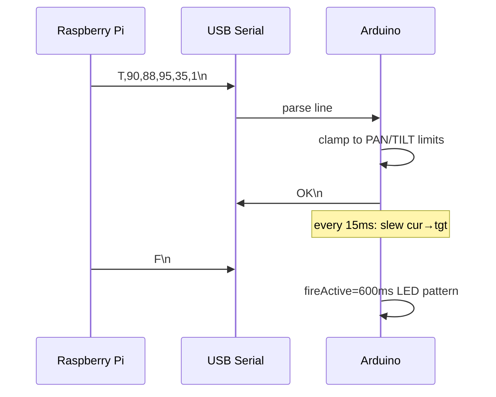

# Methodology — Communication (Rapor alt bölümü)

---

## Physical layer

| Parameter | Value |
|-----------|-------|
| Interface | USB CDC serial (Pi ↔ Arduino) |
| Port (Linux) | `/dev/ttyACM0` |
| Baud rate | **115200** |
| Framing | Line-oriented ASCII, `\n` terminated |
| Pi library | `pyserial` via `SerialLink` |

On connect: **2 s delay** after open (Arduino bootloader reset), then `reset_input_buffer()`.

---

## Packet structure (primary command)

**Format (Pi → Arduino):**

```
T,<pan>,<tilt>,<eyeX>,<eyeY>,<laser>\n
```

| Field | Type | Range | Meaning |
|-------|------|-------|---------|
| `T` | literal | — | Tracking command prefix |
| `pan` | int | 0–180 (clamped in firmware) | Pan servo degrees |
| `tilt` | int | 0–180 | Tilt servo degrees |
| `eyeX` | int | 0–180 | Eye horizontal |
| `eyeY` | int | 0–180 | Eye vertical |
| `laser` | 0 or 1 | binary | Laser GPIO enable |

**Example:**

```
T,90,90,95,35,1
```

**Pi construction** (`serial_link.py`):

```python
line = f"T,{pan},{tilt},{eye_x},{eye_y},{1 if laser else 0}\n"
ser.write(line.encode("ascii"))
```

---

## Auxiliary commands

| Command | Direction | Response | Purpose |
|---------|-----------|----------|---------|
| `F\n` | Pi → Arduino | — | Start 600 ms LED fire FX |
| `L,0\n` | Pi → Arduino | `LIM_OFF` | Disable soft limits (calibration only) |
| `L,1\n` | Pi → Arduino | `LIM_ON` | Enable soft limits (normal run) |
| — | Arduino → Pi | `OK\n` | Per-line ack (Pi discards buffer, non-blocking) |

`main.py` startup: `send_raw("L,1")` ensures safe limits.

---

## Rate limiting

- Pi: `command_hz: 30` → minimum interval 33.3 ms between sends (unless `force=True`)
- Arduino: accepts lines as fast as serial arrives; applies targets to internal `tgt*` floats
- Main loop may run faster than 30 Hz but serial throttles bandwidth

---

## Protocol timeline (for Fig. — sequence)



---

## Failsafe semantics

| Condition | Firmware action |
|-----------|-----------------|
| No valid line for **500 ms** | Targets → center constants; laser off |
| Buffer overflow | Line discarded, `bufLen=0` |
| Invalid `T` fields | Line ignored |

Center constants (measured): PAN 90, TILT 90, EYEX 95, EYEY 35.

---

## Safe limits (when `limitsOn == true`)

| Axis | Min | Max |
|------|-----|-----|
| Pan | 55 | 125 |
| Tilt | 35 | 145 |
| Eye X | 55 | 135 |
| Eye Y | 0 | 70 |

Matches `config.yaml` `servos:` section — **dual configuration** intentional: Pi plans within range; Arduino enforces last line of defense.

---

## Reconnection behavior

`SerialLink._ensure_open()`:

- On write failure → close port, retry every `reconnect_delay_s` (2.0)
- Main vision loop **never blocks** waiting for Arduino (returns `False` if not connected)

---

## Bandwidth estimate (for paper)

Typical line: `T,90,90,95,35,1\n` ≈ 20 bytes  
At 30 Hz → ~600 B/s ≪ 115200 baud (~11.5 kB/s theoretical) → serial lag negligible if USB stable.

---

## Bring-up test protocol

`serial_test.py`:

- One-shot: `python3 serial_test.py 90 90 90 90 1`
- Sweep: pan min→max
- Interactive RAW: `L,0` + continuous 20 Hz pump (defeats failsafe for limit finding)

**Paper note:** Mention RAW mode only as **calibration procedure**, not production.

---

## LaTeX paragraph draft

*The Raspberry Pi and Arduino communicate over USB at 115200 baud using human-readable comma-separated commands terminated by newline characters. The primary tracking packet carries five fields: command tag, pan, tilt, eye X, eye Y, and laser enable. The microcontroller acknowledges each accepted tracking line with “OK” although the host may flush the receive buffer without blocking on acknowledgments to preserve real-time video processing. Command rate on the host is capped at 30 Hz. If no valid command arrives for 500 ms, firmware enters failsafe mode, smoothly returning all servos to documented center poses and de-asserting the laser. Supplemental “F” and “L,n” commands trigger LED effects and limit enforcement without changing the tracking packet grammar.*

---

## Code map

| Layer | File |
|-------|------|
| Pi TX | `turret/serial_link.py` |
| Pi usage | `turret/main.py` |
| Arduino RX/parse | `arduino/turret_firmware/turret_firmware.ino` → `applyCommand`, `readSerial` |
