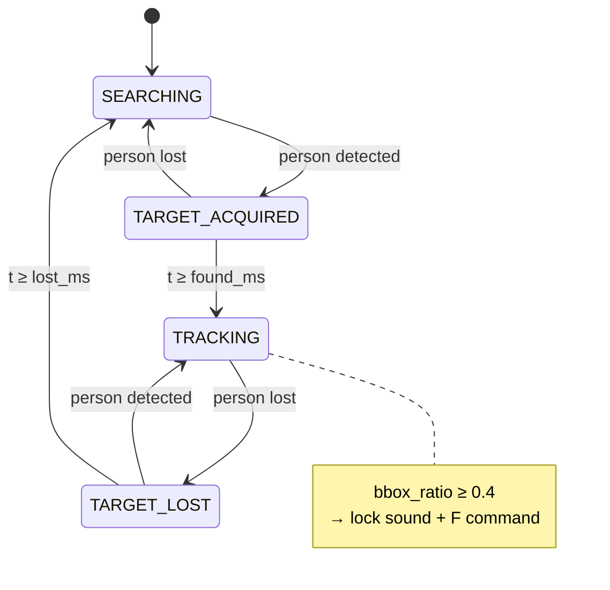

# Methodology — Control Logic (Rapor alt bölümü)

---

## Control problem formulation

**Input:** Target pixel `(aim_x, aim_y)` or `None`  
**Output:** Integer servo angles `(pan, tilt, eye_x, eye_y)` in degrees [0, 180]  
**Constraints:** Mechanical min/max per axis, slew rate, smoothing

Fixed camera + moving gun → **open-loop calibrated inverse map**, not visual servoing Jacobian.

---

## Pixel → angle mapping (`controller.py`)

Linear interpolation per axis from `config.yaml` → `calibration`:

```
pan_deg  = lerp(px, px_min, px_max, deg_at_px_min, deg_at_px_max)
tilt_deg = lerp(py, px_min, px_max, deg_at_px_min, deg_at_px_max)
```

Optional `invert: true` → `angle = 180 - angle`

**Calibration data** from `calibrate.py`: user places laser on physical point, clicks matching pixel; extremes on left/right and top/bottom define the map.

---

## Smoothing (anti-jitter)

Two-stage on Pi:

1. **Low-pass:** `nxt = cur + alpha * (target - cur)` with `alpha = 0.55`
2. **Slew cap:** max `12°` change per frame (`max_step_deg`)

Arduino adds second slew: `3°` per 15 ms loop (`MAX_STEP_DEG` in firmware).

**Deadzone** (eye_direct mode): if target within `deadzone_px` (25) of frame center, eyes hold position.

---

## Eye coordination

| Mode | `eye_direct` | Behavior |
|------|--------------|----------|
| true (default) | Eyes map directly from target pixel to eye servo range |
| false | Eyes follow pan/tilt deviation × `eye_follow_gain` (0.35) |

---

## State machine (`main.py`)

### States

| State | Entry condition | Behavior |
|-------|-----------------|----------|
| `SEARCHING` | Initial / after lost timeout | No target → center servos; optional `idle_scan` random pan |
| `TARGET_ACQUIRED` | Person detected from SEARCHING | Wait `found_ms` (1000 ms) stable |
| `TRACKING` | After found timer + sound `found` | Continuous aim; fire rule active |
| `TARGET_LOST` | Person lost from TRACKING | Immediate; if regained within logic → TRACKING |

### Transitions (timer values from `config.yaml`)

```
SEARCHING --[person seen]--> TARGET_ACQUIRED
TARGET_ACQUIRED --[lost]--> SEARCHING
TARGET_ACQUIRED --[≥ found_ms]--> TRACKING (+ play "found")
TRACKING --[lost]--> TARGET_LOST
TARGET_LOST --[person seen]--> TRACKING  (reacquire)
TARGET_LOST --[≥ lost_ms]--> SEARCHING (+ play "lost")
```

`reacquire_ms: 500` documented in yaml (legacy Turret.ini); LOST→TRACKING is immediate on re-detection in code.

### Fire / lock trigger (TRACKING only)

```python
bbox_ratio = (w * h) / (frame_w * frame_h)
if bbox_ratio >= fire_bbox_ratio (0.40):
    play "lock" sound group
    send_raw("F")  # LED choreography on Arduino
    respect fire_cooldown_ms (4000)
```

Optional **recoil** (`recoil.enabled`): sinusoidal pan/tilt offset during `fire_duration_ms` (600 ms) — default **off** in config.

---

## State machine diagram (for paper)



---

## Idle scan (optional)

`idle_scan.enabled: false` by default.

When true in SEARCHING: random pan/tilt targets every 1.5–4 s for “looking around” behavior.

---

## Audio side effects (non-blocking control)

| Event | Sound group | Example files |
|-------|-------------|---------------|
| → TRACKING | `found` | ISeeYou.wav, ThereYouAre.wav |
| Lock/fire | `lock` | Gotcha.wav, Fire.wav |
| → SEARCHING from LOST | `lost` | AreYouStillThere.wav |

`sound.play()` never blocks main loop.

---

## LaTeX paragraph draft

*High-level behavior is governed by a four-state finite-state machine with debounced acquisition and loss timers inherited from classic turret demos but implemented deterministically in milliseconds. Tracking commands are generated only in acquired or tracking states; otherwise the controller commands center pose or optional idle scan waypoints. Pixel coordinates are converted to pan and tilt angles through piecewise-linear calibration surfaces identified offline. Command smoothing combines a first-order low-pass filter with a per-frame slew limit to mitigate detection jitter and mechanical vibration. A secondary fire rule triggers when the person bounding box occupies at least 40% of the image area, indicating close range; this activates audio and an auxiliary LED sequence on the microcontroller without altering the serial angle format.*

---

## Code map

| Component | File |
|-----------|------|
| FSM | `turret/main.py` |
| Angles | `turret/controller.py` |
| Timers | `turret/config.yaml` → `timers:` |
| Calibration tool | `turret/calibrate.py` |
