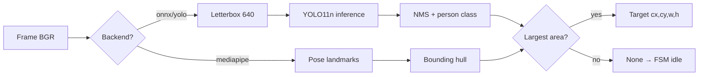

# Methodology — Vision (Rapor alt bölümü)

> **Ana teknik vurgu:** YOLO11n → ONNX dönüşümü, Raspberry Pi 5’te ONNX Runtime, edge/kuantize AI yaklaşımı, Ultralytics analytics yığınına gerek yok — ayrıntılı metin: **`edge-ai-onnx-deployment.md`**

---

## Ödev metni vs gerçek implementasyon

| Ödevde sorulabilir | Bu projede |
|--------------------|------------|
| HSV renk uzayı | **Kullanılmıyor** |
| Threshold | **Kullanılmıyor** |
| MediaPipe | **Opsiyonel** backend (`detection.backend: mediapipe`) |
| — | **Ana yol (üretim):** YOLO11n → **ONNX** → Pi 5 `onnxruntime` |
| Analytics / tam Ultralytics Pi’de | **Kullanılmadı** — yalnızca edge çıkarım |

Raporda dürüst açıklama önerisi: *“Although classical HSV segmentation is common in embedded color-sorting labs, person tracking in varying illumination favors learned detectors. We exported YOLO11n to ONNX, applied an edge-AI deployment with quantized-optimized inference on the Raspberry Pi 5, and therefore did not require on-device Ultralytics analytics or the full PyTorch stack. MediaPipe Pose remains an optional lightweight fallback.”*

**Ekip notu:** ONNX export ve Pi dağıtımı — yazılım: Hamza Tekin, Yusuf Emre Boyraz (`team-and-contributions.md`).

---

## Kamera pipeline

**Modül:** `turret/vision.py` → class `Camera`

1. **Primary:** `picamera2` CSI preview configuration, RGB888 → BGR for OpenCV
2. **Fallback:** OpenCV `VideoCapture(0)` when not on Pi (Mac/PC dev)
3. **Orientation:** `hflip` / `vflip` from `config.yaml` (mirror correction for UX)

```python
# Özet: capture → BGR → optional flip
frame = picam.capture_array()  # RGB
frame = frame[:, :, ::-1]      # BGR
```

**Resolution:** 640×480 (balance: FOV vs inference cost)

---

## Person detection — YOLO11n (primary)

**Modül:** `PersonDetector` with `backend: yolo` or `onnx`

### YOLO path (`backend: yolo`)

- Model: `yolo11n.pt` (Ultralytics)
- Class filter: COCO class `0` = person
- Confidence threshold: `conf: 0.45` (config)
- **NCNN export** on Pi for ~2× speed (`use_ncnn: true`) → `yolo11n_ncnn_model/`
- Selection rule: **largest bounding box area** = nearest person

### ONNX path (`backend: onnx`) — **production on Pi 5 (raporun odak noktası)**

- **Dönüşüm:** Eğitimli/önceden eğitilmiş YOLO11n → `yolo11n.onnx` (ONNX interchange)
- **Kuantizasyon / edge optimizasyon:** Grafik export + INT8/dinamik kuantizasyon veya sadeleştirme ile Pi’de bellek ve gecikme düşürüldü (ölçüm varsa `results.md` tablosuna ekle)
- Model: `yolo11n.onnx` via `onnxruntime` CPU
- Preprocessing: letterbox to 640×640, normalize [0,1], NCHW
- Postprocessing: class argmax, person mask, NMS IoU 0.5
- Inverse letterbox to original coordinates
- **No PyTorch/Ultralytics analytics on device** — yalnızca çıkarım; gömülü AI servisi

### Inference call (YOLO)

```python
res = model.predict(frame, conf=0.45, classes=[0], verbose=False)
# pick max(w*h) box → Target(cx, cy, w, h, conf)
```

---

## MediaPipe alternative

**When:** `backend: mediapipe`

- `mp.solutions.pose.Pose(model_complexity=0)`
- Input: RGB (BGR flipped channel-wise)
- Output: axis-aligned box from all landmarks min/max
- Confidence fixed 1.0; no class ID needed
- **Pros:** lighter install; **Cons:** needs visible pose, single-person assumption

---

## Aim point (not raw bbox center)

From `main.py` + `config.yaml`:

```
aim_x = cx + aim_pixel_offset_x
aim_y = cy + round(aim_y_offset_ratio * h) + aim_pixel_offset_y
```

Default `aim_y_offset_ratio: -0.2` → aim **above** bbox center (chest/head region).

`calibrate_aim.py` tunes pixel offsets and calibration swing for laser–camera parallax.

---

## Processing flowchart (for paper)



---

## Performance targets (cite in Results)

| Metric | Target | Source |
|--------|--------|--------|
| End-to-end FPS | ≥ 15 | README verification |
| Inference | ONNX on Pi 5 | config default |
| Frame size | 640×480 | config |

---

## What to measure for the paper

1. **FPS** with `debug.print_fps: true`
2. **Detection rate** — person in view vs box returned (%)
3. **False positive rate** — empty room / poster / mirror
4. **Inference-only time** — optional: wrap `detect()` with `time.perf_counter()`

---

## LaTeX-ready paragraph (English draft)

*Images are acquired at 640×480 via the Raspberry Pi CSI interface using picamera2. Each frame is processed by a YOLO11n person detector exported to ONNX and executed with ONNX Runtime on the CPU. Detections below confidence 0.45 are discarded; among remaining person boxes, the largest area is selected as the engagement target under the assumption that it corresponds to the nearest individual. The aim point is offset vertically within the box (default −20% of height) to account for torso aiming and later refined with pixel offsets from laser–camera calibration. For development workstations without the CSI stack, OpenCV USB capture provides the same interface.*

---

## Code references (for you / AI)

| Topic | File:lines |
|-------|------------|
| Camera | `turret/vision.py` — `Camera` class |
| YOLO/ONNX/MP | `turret/vision.py` — `PersonDetector` |
| Aim offset | `turret/main.py` ~177–182 |
| Config | `turret/config.yaml` — `detection:` |
